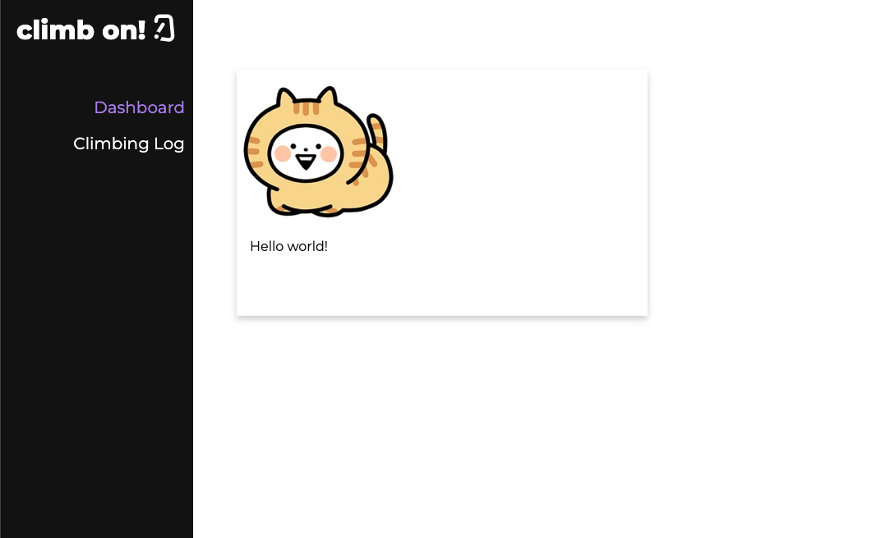
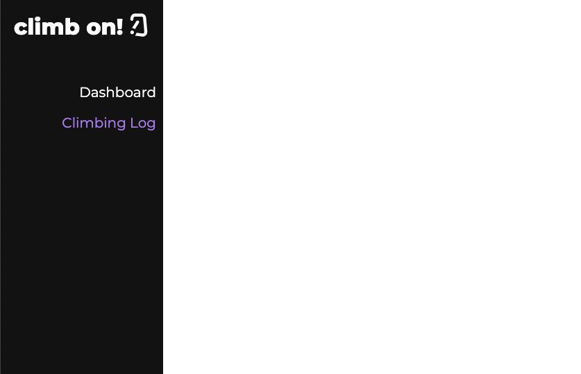

## What I planned on doing for this HW deadline: 
From the last deadline, I planned on creating prototypes of my application so that I have a direction on how I want to design
my application and constructing my database and filling it up with dummy data that I am able to use in my application.

## What I accomplished: 
Over the last few weeks, my goals have changed a little bit. I had to review ReactJs and functional components and was struggling with drawing out on Figma how I want my application to look. I was able to accomplish some front end work by implementing a navigation bar component and figuring out the functionality of the navigation bar by utilizing React UseState hooks. Additionally, over this last week as I was looking into how to integrate Postgres with React, I found out about Postgraphile and GraphQL to manage my database. Even my goals from the last checkpoint mentioned working on my back end, I am glad that I was able to work more on the front end piece –– If I hadn't, I probably would have been stuck trying to figure out my back end work without a front end to display the data. 

## My goals for the next deadline: 
For this next deadline, my goal is to implement a login system. Before I build my database, I think it would be better to first understand how I can build a log in system in my application and understand how different users are indentified in my application. Once I implement a log in and understand how the app recognizes each user, I then want to build my data base and see if I can integrate the data into my application into the cards. I also want to accomplish being able to add to my database through my application as well. So overall, my goals is to understand the technologies I need to integrate PostgresSQL with ReactJS by researching GraphQL and Postgraphile. 

## Screenshots: 

The two screenshots show the functionality of the navigation bar. The dashboard is where the cards for the users appear that will hold different kinds of climbing information. The second screenshot is the climbing log tab which will have a form that will allow users to add to their climbing log or view their climbing log. 
