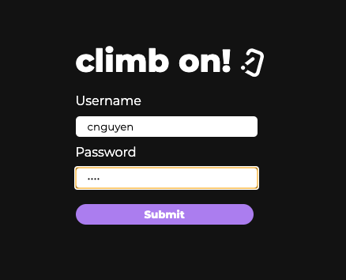
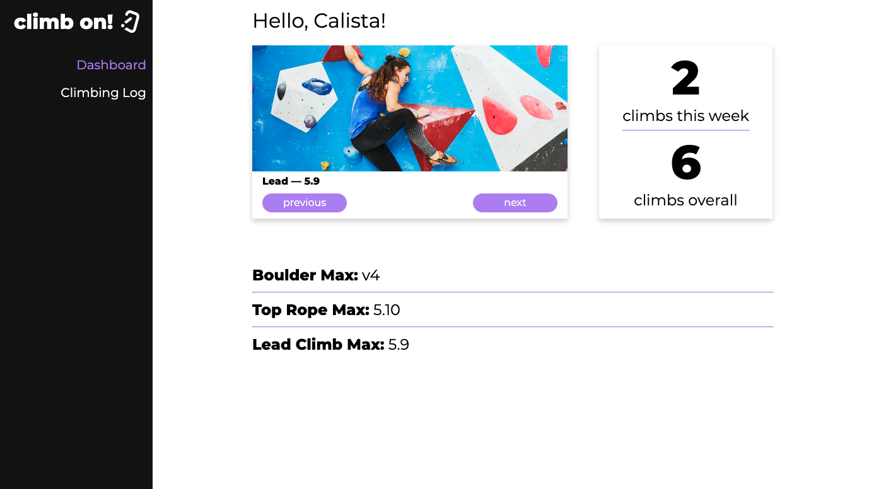
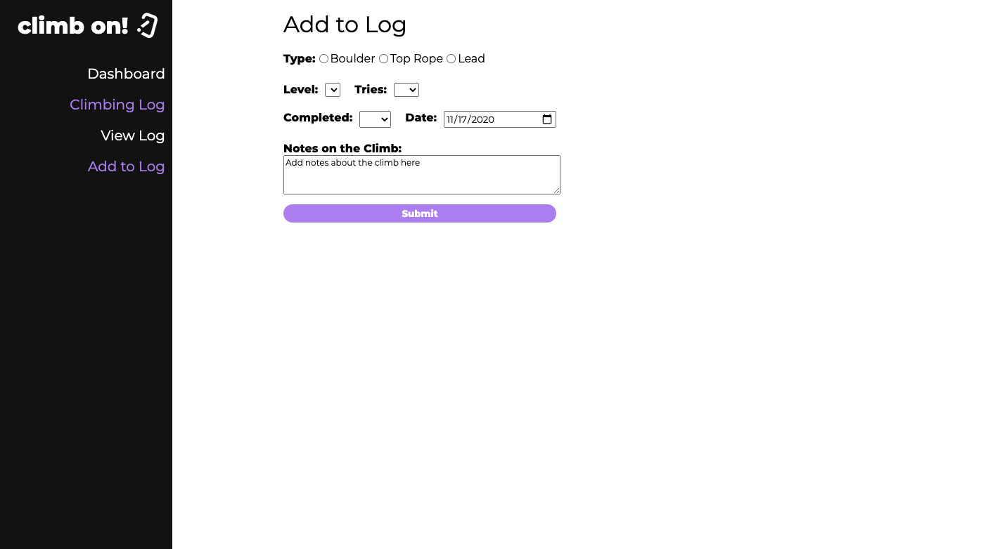

## What I planned on doing for this HW deadline (pasted from last week): 
For this next deadline, my goal is to implement a login system. Before I build my database, I think it would be better to first understand how I can build a log in system in my application and understand how different users are indentified in my application. Once I implement a log in and understand how the app recognizes each user, I then want to build my data base and see if I can integrate the data into my application into the cards. I also want to accomplish being able to add to my database through my application as well. So overall, my goals is to understand the technologies I need to integrate PostgresSQL with ReactJS by researching GraphQL and Postgraphile. 

## What I accomplished: 
Over the last few weeks, I was able to accomplish all of my goals. First, I had to understand how to use Postgraphile/GraphQL to query data from my database in order to implement a log in. I did this by using the ide provided by Postgraphile when you run the server. I then had to figure out how I integrate GraphQL queries with my website, thus I added a new dependency called `graphql-request` which is a promise based API client that allowed me to query in my application. I was able to implement my log in and also display data on the user dashboard as well. I implemented different cards on the user dash board that displays climbs from the past week, number of climbs during the current week/overall, and the max climbs users were able to complete. I also was able to implement a form that allows users to add climbing data into my data base. What I am missing however, is how I want to store pictures of user climbs. Currently, I am just using one temporary placeholder picture. I wasn't able to complete this part because I was more focused on making sure I can query the more important data and that I can query data correctly. 

## My goals for the next deadline: 
For the next deadline, my goal is to complete the rest of the UI for my application. Currently, my LogCard component that displays the climbs a user did for the week is buggy. I also need to finish implementing the actual climbing log where a user can view all of their climbing history. These changes also include being able to query pictures and how I want to store pictures in my data base. After I complete my UI, my next goal is to then integrate unit testing within my application by using jest. 

## Screenshots: 
My login screen

The main dashboard for the user. Currently the card on the top left is a bit buggy. The array that stores the climbing data for the week keeps doubling,

The form where a user can add climbing data. Just need to add the image input. 

