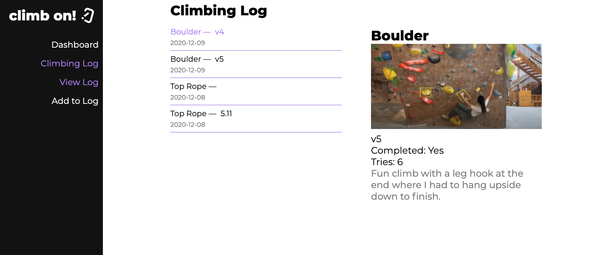

## What I planned on doing for this HW deadline (pasted from last week): 
For the next deadline, my goal is to complete the rest of the UI for my application. Currently, my LogCard component that displays the climbs a user did for the week is buggy. I also need to finish implementing the actual climbing log where a user can view all of their climbing history. These changes also include being able to query pictures and how I want to store pictures in my data base. After I complete my UI, my next goal is to then integrate unit testing within my application by using jest. 

## What I accomplished: 
What I accomplished for this deadline was fixing a lot of the bugs within my application. I fixed the LogCard component in the dashboard so that it is not buggy –– prior to this, the data loaded for the log card would keep doubling, which was really inefficient. Using the UseEffect hook, I made it so that the query to get the data needed only occurs once when the component mounts. Another part of my application that I was able to accomplish was the View Log component that allows users to view their history of climbs. I was also able to implement a simple photo upload that stores a photo for each climb. This is done by creating an object link and storing that link within my data base. I then use that link as a source when displaying the photo. The only flaw about my photo upload is that once you run the program again after terminating it, the object link doesn't work. Next time, if I were to implement a photo upload, I would need to understand how to incorporate an external database, such as Amazon S3, to store my images. The one thing I could not accomplish was Jest unit testing, as it took me a lot of time to fix my bugs within my application along with trying to research how to do photo upload, which I wasn't familiar with. However, I extensively tested my application by creating multiple users to make sure that all of my components work appropriately. For example, a user with no climbs logged will not have any climbs being displayed. 

## My goals for the next deadline: 
If I were to continue working on this project, I would work on implementing an Amazon S3 bucket to store my images and learn how to set up the backend code to create an endpoint to that S3 bucket. 

## Screenshots: 
 

Completed view log component
